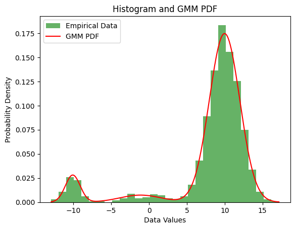

# distribution-optimization-py: Optimization-Based GMM Parameter Estimation

A Gaussian Mixture Model (GMM) is a probabilistic model that assumes all the data points are generated from a mixture of a finite number of Gaussian distributions with unknown parameters. The GMM is here rephrased as an optimization problem and solved using a Hierarchic Memetic Strategy (HMS). This approach diverges from the traditional Likelihood Maximization, Expectation Maximization approach. Instead, it introduces a fitness function that combines the chi-square test, used for analyzing distributions, with an innovative metric designed to estimate the overlapping area under the curves among various Gaussian distributions. This library offers an implementation of [DistributionOptimization](https://cran.r-project.org/web/packages/DistributionOptimization/index.html) in Python (with significant improvements).

### Experiment results

The results of the experiments can be found on the `ela-analysis` branch.

### Quick start

Create dataset:

```python
import numpy as np
random_state = np.random.RandomState(seed=1)
textbook_data = np.concatenate(
    [
        random_state.normal(-1, 1.5, 350),
        random_state.normal(0, 1, 500),
        random_state.normal(3, 0.5, 150),
    ]
)
```

Fit GMM using HMS and plot results:

```python
from distribution_optimization_py.gaussian_mixture import GaussianMixture
gmm = GaussianMixture(n_components=3, algorithm="HMS", random_state=42)
gmm.fit(textbook_data)
probabilities = gmm.predict_proba(textbook_data)
gmm.plot()
```



### Supported optimization algorithms

| algorithm | Description                                                  | library   |
|-----------|--------------------------------------------------------------|-----------|
| "HMS"     | Hierarchic Memetic Strategy                                  | `pyhms`   |
| "CMA-ES"  | Covariance Matrix Adaptation Evolution Strategy              | `pycma`   |
| "GA"      | DistributionOptimization evolutionary algorithm              | `leap_ec` |
| "DE"    | Differential Evolution iL-SHADE                                | `pyade.ilshade` |

### Relevant literature
- Lerch, F., Ultsch, A. & Lötsch, J. Distribution Optimization: An evolutionary algorithm to separate Gaussian mixtures. Sci Rep 10, 648 (2020). doi: [10.1038/s41598-020-57432-w](https://doi.org/10.1038/s41598-020-57432-w)
- J. Sawicki, M. Łoś, M. Smołka, J. Alvarez-Aramberri. Using Covariance Matrix Adaptation Evolutionary Strategy to boost the search accuracy in hierarchic memetic computations. Journal of computational science, 34, 48-54, 2019. doi: [10.1016/j.jocs.2019.04.005](https://doi.org/10.1016/j.jocs.2019.04.005)
